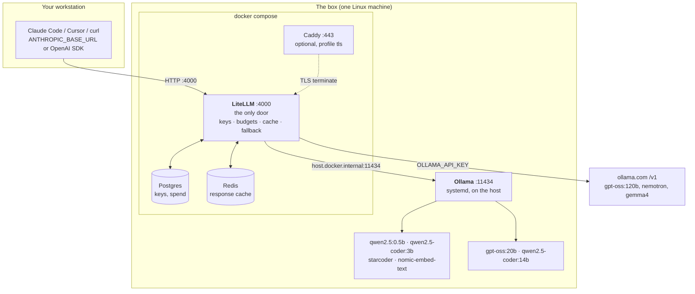
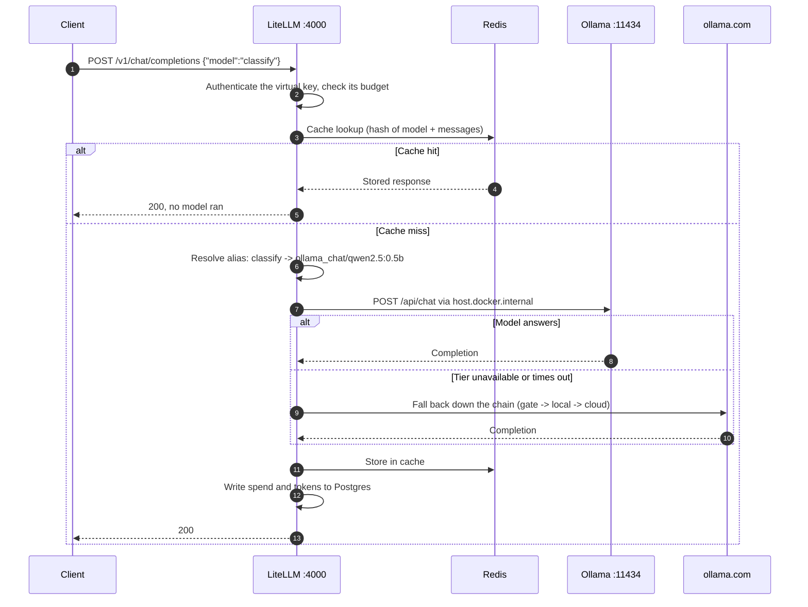

# litellm-ollama-stack

A single-box LLM gateway: [LiteLLM](https://github.com/BerriAI/litellm) in front of
[Ollama](https://ollama.com), with Postgres for keys and spend, Redis for caching, and an optional
Caddy TLS front. One OpenAI-compatible endpoint, a tiered model list, and named job aliases so callers
ask for `classify` or `commit` instead of picking a model.

## What this is

You point every client at one URL. LiteLLM decides whether that request goes to a cloud model, a local
model on the box, or a tiny local model that answers in under a second, and falls back down the chain
when a tier is unavailable.

```
clients ──> LiteLLM :4000 ──┬──> https://ollama.com/v1   (cloud, needs OLLAMA_API_KEY)
                            └──> box ollama :11434       (local, free, private)
```

What you get over talking to Ollama directly: virtual API keys with per-key budgets, a usage dashboard,
a Redis response cache, automatic fallback between tiers, and one endpoint that does not change when you
swap the model behind a name.

Everything here runs on hardware you own. Local models cost nothing per token. The cloud tier is optional
and needs a key from `ollama.com` (or DeepInfra, via `add-deepinfra.sh`).

## Architecture

Everything a client sends enters at one port. Nothing talks to Ollama or to a cloud provider directly.



The one edge worth knowing: `host.docker.internal` resolves to the **Docker bridge gateway**, not to
loopback. That is why Ollama must stay bound to `0.0.0.0` and be restricted with a firewall rather than
bound to `127.0.0.1`. Binding it to loopback silently severs the container's only route to it. See
[docs/hardening-checklist.md](docs/hardening-checklist.md).

## Call-site flow

What actually happens when a client asks for `classify`:



Two consequences follow from that ordering, and both matter in practice.

**The alias is the routing decision.** A caller asks for `commit` or `explain`, never for a model name.
Swapping the model behind an alias is a one-line change in `config.yaml` that no client has to hear about.

**Fallback is per alias, not global.** Each entry in `router_settings.fallbacks` names its own chain, so a
cheap local alias degrades to another local model rather than silently spending cloud quota. Local entries
carry `input_cost_per_token: 0` so a budget limit can never block a free request.

## Quick start

Five minutes, assuming Docker and Ollama are already on the box.

```bash
# 1. Point the scripts at your box (git-ignored; or just export these)
cat > .env.local <<'EOF'
BOX_HOST=10.0.0.20
BOX_USER=ubuntu
BOX_DEST=/home/ubuntu/litellm-stack
EOF

# 2. Check the hardware is worth it
./hw-check.sh

# 3. First deploy: copies the stack over, creates .env on the box, then STOPS
./deploy.sh

# 4. Fill in the secrets on the box, then deploy for real
ssh "$BOX_USER@$BOX_HOST" '$EDITOR /home/ubuntu/litellm-stack/.env'   # openssl rand -hex 24
./deploy.sh

# 5. Pull the models
./pull-models.sh mid

# 6. Create a virtual key at http://<BOX_HOST>:4000/ui, then:
curl -s "http://$BOX_HOST:4000/v1/chat/completions" \
  -H "Authorization: Bearer $LITELLM_VIRTUAL_KEY" -H "Content-Type: application/json" \
  -d '{"model":"classify","messages":[{"role":"user","content":"one word: is package.json config, test, or source?"}]}'
```

Step 3 stopping is deliberate. `POSTGRES_PASSWORD` is written into the database volume the first time
Postgres starts and cannot be changed afterwards, so the script refuses to start the stack while `.env`
still holds `CHANGE_ME`.

Then read [docs/hardening-checklist.md](docs/hardening-checklist.md) before using it for anything real.
Ollama ships with no authentication of any kind.

## Prerequisites

- A Linux box with Docker and the Compose plugin, reachable over SSH with key auth.
- [Ollama](https://ollama.com/download) installed on that box as a systemd service.
- 16 GB RAM runs the small local models comfortably. A 20B model needs about 16 GB free on top of the
  operating system. No GPU is required, but see [docs/health-and-throughput.md](docs/health-and-throughput.md)
  for what CPU-only inference actually costs you in tokens per second.
- On your workstation: `bash`, `ssh`, `scp`, and `curl`.

Run `./hw-check.sh` against the box before anything else. It reports cores, RAM and GPU so you can decide
which models are worth pulling.

## Configure

The scripts take the target box from environment variables. Set them in your shell, or create a
`.env.local` next to the scripts (it is git-ignored and read automatically):

```bash
BOX_HOST=10.0.0.20                  # LAN IP or hostname of the box
BOX_USER=ubuntu                     # ssh login
BOX_SSH_KEY=~/.ssh/id_ed25519       # optional, this is the default
BOX_DEST=/home/ubuntu/litellm-stack # directory on the box that holds the stack
LITELLM_VIRTUAL_KEY=<your-litellm-virtual-key>   # from the LiteLLM UI, for client use
```

Every script fails immediately and names the variable if one is missing, so nothing half-runs against
the wrong host.

Separately, the stack's own secrets live in `.env` **on the box**, not here. You do not create that file
yourself: the first `./deploy.sh` copies `.env.example` over, creates `.env` from it, and stops so you can
fill it in. Edit it on the box, then run `./deploy.sh` again.

`LITELLM_MASTER_KEY` is admin access to the proxy. Generate it with `openssl rand -hex 24` and give it
the prefix LiteLLM expects. `LITELLM_SALT_KEY` encrypts stored provider keys: set it once and never
change it, or those rows become unreadable. `POSTGRES_PASSWORD` is baked into the database volume on
first start; changing it later breaks the database. `.env` is git-ignored. Do not commit it.

## Deploy

```bash
./deploy.sh
```

That copies `docker-compose.yml`, `config.yaml`, `.env.example` and the Caddyfile to the box, creates
`.env` there if it is absent, pulls images and brings the stack up. It prints `docker compose ps` and
the liveness probe when it finishes.

Pull the models you want:

```bash
./pull-models.sh mid      # or: heavy
```

Check what is actually running at any time with `./probe-remote.sh`, which is read-only.

The admin UI is at `http://<BOX_HOST>:4000/ui`. Log in with `UI_USERNAME` and `UI_PASSWORD`, then create
a virtual key for your clients. Hand out virtual keys, never the master key: they carry their own budget
and you can revoke one without touching anything else.

## Models and job aliases

Three tiers, described in full in [MODELS.md](MODELS.md).

**Cloud** (via `ollama.com`, needs `OLLAMA_API_KEY`): `agent` is the tool-calling driver, `cloud-big`
handles high-volume batch work, `think` is reasoning-tuned, `vision` is the only model that can read an
image, and `cloud-small` is the cheapest on quota.

**Local, large**: `local` and `coder` run on the box. They are free and private but slow on CPU. Treat
them as fallbacks, not as your main path.

**Local, tiny — the job aliases.** These are the real value of running your own box. The name is the
routing decision, so scripts never have to think about models:

| alias | job |
|---|---|
| `classify` | one-word routing answers |
| `extract` | logs, invoices and emails into JSON |
| `gate` | yes/no decisions in shell scripts and automations |
| `commit` | a commit message from a diff |
| `docstring` | docstrings and type hints |
| `oneliner` | the regex, `awk` or `jq` you forgot |
| `explain` | what this function does |
| `autocomplete` | fill-in-the-middle editor completion |

They answer in a fraction of a second and cost nothing. Rule of thumb: if a job runs more than fifty
times, run it locally. Cloud quota is for thinking, not for grinding.

`embed` serves embeddings for retrieval.

## Use with Claude Code

```bash
export ANTHROPIC_BASE_URL="http://$BOX_HOST:4000"
export ANTHROPIC_AUTH_TOKEN="$LITELLM_VIRTUAL_KEY"
export ANTHROPIC_API_KEY=""
export ANTHROPIC_MODEL=agent
export ANTHROPIC_SMALL_FAST_MODEL=cloud-small
claude
```

Or `source claude-code-local.sh` and use the `claude-proxy` shell function, which sets all of it for you
and takes `M=<model>` to override the model.

Tool calling through this proxy is verified working on `gpt-oss:120b` (the `agent` alias): a real session
listed a directory and read a file, making genuine tool calls rather than describing them. Measurements
are in [docs/health-and-throughput.md](docs/health-and-throughput.md).

One caveat worth knowing before you rely on it: Ollama Cloud does not do prompt caching, so every turn
resends the entire context. A small task cost roughly 54,000 tokens across three turns. Budget
accordingly on a metered plan.

## Security

Read [SECURITY.md](SECURITY.md) before exposing any of this beyond your own machine. The short version:

- **Ollama has no authentication.** If it is bound to `0.0.0.0`, anyone on your network can run any model
  and read any prompt. Firewall port 11434 to the Docker bridge only. Do not "fix" this by binding Ollama
  to `127.0.0.1` — that breaks the container's route to it. The reasoning is in
  [docs/hardening-checklist.md](docs/hardening-checklist.md).
- **Never expose port 4000 to the internet** without TLS and a firewall. The Caddy profile
  (`docker compose --profile tls up -d`) exists for this.
- **Rotate the master key** from whatever you first set, and never commit `.env`.
- The Postgres and Redis containers are deliberately not published to the LAN.

## Known quirks

[docs/health-and-throughput.md](docs/health-and-throughput.md) documents two behaviours that look like
bugs and are not: the admin UI's health tab reports false failures on a CPU-only box, and requests from
the box's own shell to `localhost:4000` can stall for over a minute while the same request from the LAN
is instant.

## Documentation

| file | what |
|---|---|
| [MODELS.md](MODELS.md) | what each model is good for |
| [HOSTING.md](HOSTING.md) | hosting and exposure options |
| [docs/setup-steps.md](docs/setup-steps.md) | ordered first-run walkthrough |
| [docs/hardening-checklist.md](docs/hardening-checklist.md) | what to lock down before real use |
| [docs/health-and-throughput.md](docs/health-and-throughput.md) | measured speeds and known quirks |
| [docs/verdict.md](docs/verdict.md) | which models are worth running on CPU |
| [docs/ollama-cloud-signup.md](docs/ollama-cloud-signup.md) | cloud provider sign-up and pricing |
| [docs/wayland-bug-report.md](docs/wayland-bug-report.md) | an unrelated packaging bug hit on the same box, kept as a filed report |

## License

MIT. See [LICENSE](LICENSE).
